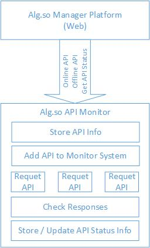

#alg.so 算法监控平台设计

##1. 功能概述

+ 监控开发者提供的服务地址的状态：可用|不可用。
  一定周期的实时监控。可以只做端口检测，更好的方式是根据用户提供的简单case进行验证。
+ 测试开发者提供的服务地址的性能
  性能指标包括QPS和单个请求的处理时间。性能数据供算法平台使用。
+ 将开发者提供的服务封装成一个统一的rpc服务，方便调用者使用。
  至于接口还要进一步考虑。
+ 分别为开发者和调用者这两种类型的用户提供一些终端工具。
  对于开发者可以方便服务地址的提交和发布。
  对于调用者可以方便算法平台的服务。

##2. 监控平台工作流程

##3. 需要做的工作

+ 监控服务可用性工具
+ 测试服务性能工具
+ 统一服务调用的RPC服务
+ 一个和算法平台接口的服务
+ 调用者&开发者的终端工具

##4. 技术方案

+ 监控服务可用性和测试服务性能的工具可以使用脚本实现python或者ruby都可以做。
+ 统一服务调用的RPC服务可以使用Sofa来实现，高并发。
+ 和算法平台接口的服务可以使用简单的HTTP服务
+ 调用者&开发者的终端工具可以使用脚本语言开发。

以上只是初稿，还有很多没有考虑到的问题，欢迎大家补充，另外，还有一些细节问题也有待于商讨。
